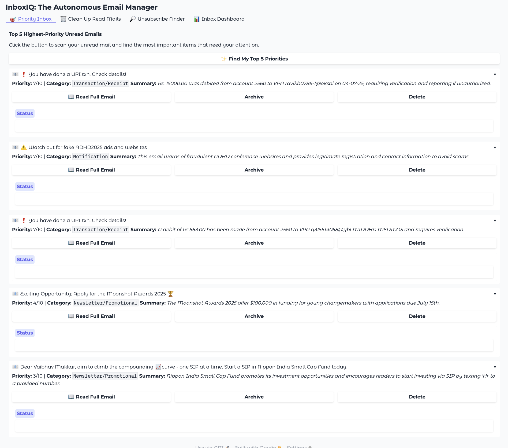
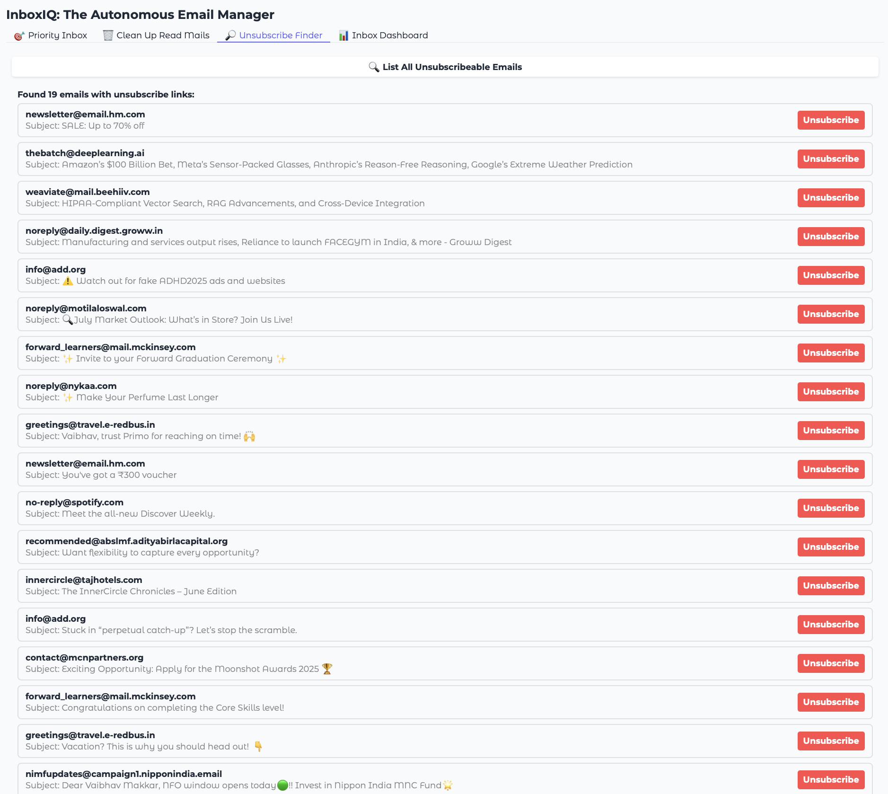
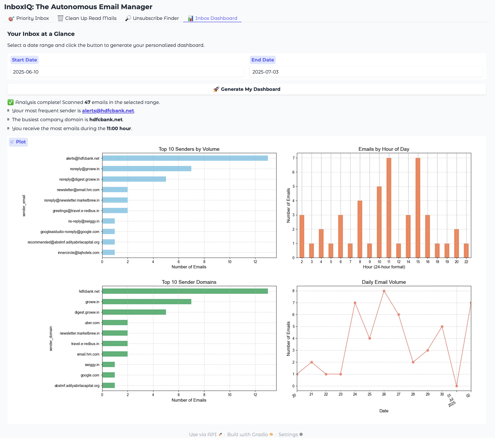

**InboxIQ: The Autonomous Email Manager**

InboxIQ is a smart email management tool that uses the power of Google's Gemini LLM to help you take control of your Gmail inbox. It connects securely to your Gmail account, analyzes your emails, and provides intelligent tools to prioritize, clean up, and understand your email habits.

The goal of InboxIQ is to transform a cluttered inbox into a manageable one by automating common tasks like identifying important messages, finding junk to delete, and making it easy to unsubscribe from promotional lists.

**Key Features**

🎯 Priority Inbox: Automatically scans your unread emails, uses AI to assign a priority score and category, and presents the 5 most critical messages that need your attention.
🗑️ Inbox Cleanup: Finds the 5 lowest-priority read emails, allowing you to quickly archive or delete unimportant messages and reduce clutter.
🔎 Unsubscribe Finder: Scans your recent inbox for promotional emails and newsletters, extracting the direct unsubscribe links so you can easily opt-out with a single click.
📊 Inbox Health Dashboard: Generates a personalized dashboard with visualizations of your email statistics, including your top senders, busiest domains, and email volume by hour and day.

**UI:Here's a look at the four main tabs of the InboxIQ interface.**

Priority Inbox:
The Priority Inbox tab, showing AI-generated summaries and action buttons.

Inbox Cleanup:
The Cleanup tab, identifying low-priority read mail for easy deletion.

![Screen 2(InboxIQ_UI/Inbox_Cleanup_Section.png)

Unsubscribe Finder:	
The Unsubscribe Finder, presenting a list of emails with direct unsubscribe links.

Inbox Dashboard:
The Dashboard, displaying charts and statistics about your email patterns.

**Technology Stack**

Backend: Python
Web Framework: Gradio
LLM: Google Gemini
APIs: Gmail API
Libraries: Pandas, Matplotlib, Google API Client, BeautifulSoup
Setup and Usage

**Follow these steps to get InboxIQ running on your local machine**

Step 1: Set Up Google Cloud & Gmail API Credentials
To allow the application to access your Gmail account, you need to create credentials in the Google Cloud Console.

Go to the Google Cloud Console.
Create a new project (or select an existing one).
In the navigation menu, go to APIs & Services > Library.
Search for and enable the Gmail API.
Go to APIs & Services > Credentials.
Click Create Credentials > OAuth client ID.
If prompted, configure the OAuth consent screen. Select External and provide a name for the app. You can skip the optional scopes and add your email as a test user.
For the Application type, select Desktop app.
After creation, a modal will appear with your Client ID and Client Secret. Click DOWNLOAD JSON.
Rename the downloaded file to credentials.json and place it in the root directory of this project.

Step 2: Set Up Google Gemini API Key
The app uses Google's Gemini model for email analysis.
Go to Google AI Studio to generate an API key.
In the root directory of this project, create a new file named .env.
Add your API key to the .env file in the following format:
Generated code
API_KEY="YOUR_GEMINI_API_KEY_HERE"

Step 3: Install Dependencies
Install all the required Python packages using the requirements.txt file.
pip install -r requirements.txt

Step 4: Run the Application
You are now ready to launch the Gradio web interface.

Step 5: First-Time Authentication
When you run app.py for the first time, your web browser will automatically open a Google authentication page.
Choose the Google account you want to use with the app.
You will see a "Google hasn’t verified this app" warning. This is expected because it's a personal project. Click Advanced, then "Go to [Your App Name] (unsafe)".
Grant the application permission to view and modify your emails.
After you approve, the application will store your authentication credentials in a new file named token.json in the project directory.
You are all set! The Gradio app will now be running, and you won't have to authenticate again unless the token expires or is deleted.
